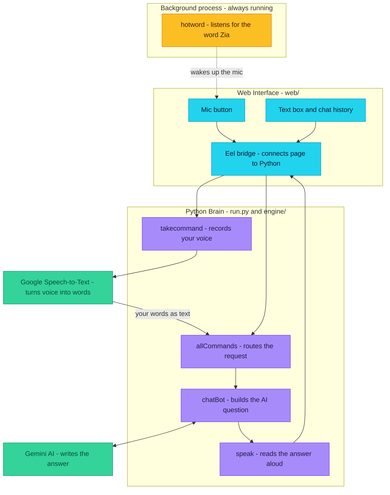
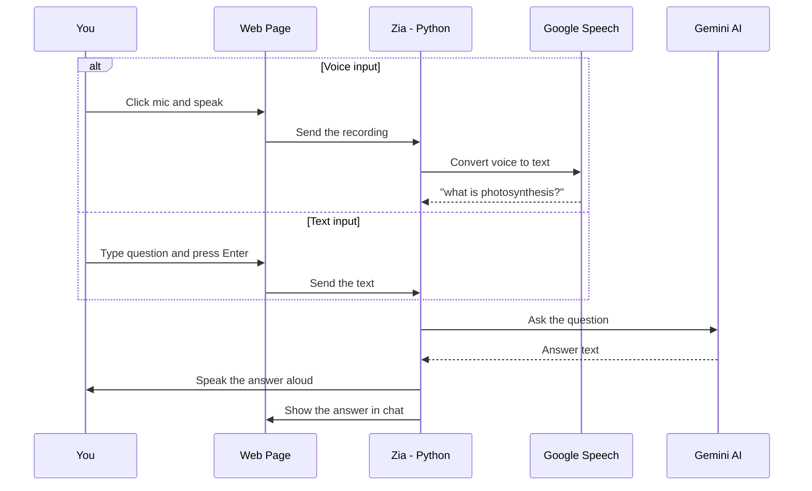

<div align="center">

# Zia — Voice + Text AI Assistant

**Your PC already has a speaker and a microphone. Zia is what happens when you put them together.**


*A mini Alexa/Siri that runs on your PC — no code reading needed to understand this project. Everything is below.*

</div>

---

## The Setup

It's evening. You're at your keyboard, hands tired, and you want to know one small thing. Asking your phone means unlocking it, opening an app, typing, reading. Waking the speaker across the room means repeating yourself.

What if the machine in front of you could just listen?

Zia is a small assistant that lives on your Windows PC. You press a button — or simply say her name — ask anything out loud, and she answers back in a real voice, with the reply written on screen as well. Prefer to type? She types back. No phone, no extra gadget, no ceremony.

- [First Contact](#first-contact)
- [Her Reflexes](#her-reflexes)
- [Always Awake](#always-awake)
- [A Journey Through Her Mind](#a-journey-through-her-mind)
- [One Question, One Second](#one-question-one-second)
- [The Cast](#the-cast)
- [Wake Her Up](#wake-her-up)
- [The Map](#the-map)
- [Honest Limits](#honest-limits)
- [Your Turn](#your-turn)

---

## First Contact

You click the mic. The page waits while it listens. *"What is photosynthesis?"* A beat later, Zia's voice fills the room with the answer, and the same words appear as a chat bubble beside her name.

That's the whole ritual. People use her for small things — a definition, a poem, a quick explanation — and they reach her in whichever way the moment allows:

| You say or type | Zia does |
|---|---|
| `what is photosynthesis?` | Answers with voice + on-screen chat (Google Gemini AI) |
| `write a poem about rain` | Replies with a poem, spoken and shown in chat |
| `Zia` *(wake word)* | Wakes up and opens the mic for you |

Speak or type — same brain, same answer, either way.

---

## Her Reflexes

Zia is not a bag of features; she has five habits, and you've already guessed most of them:

- **She talks back** — you speak, she answers out loud through your speakers, no headphones required.
- **She writes back too** — can't talk right now? Type in the box; the answer still arrives, spoken *and* shown in chat.
- **She knows things** — Google Gemini drafts every reply, from homework explanations to poems about rain.
- **She knows her own name** — say "Zia" and the microphone opens without you touching the mouse.
- **She has a home** — an animated web screen with chat history, a mic button, and a text box, always in reach.

---

## Always Awake

Behind the main window, a second process never sleeps. It isn't listening to *you* — it's listening for one word: *Zia*. Say it from across the desk and the microphone wakes on its own, ready for your question. Think of it as a light switch made of sound.

Which raises the natural question: what happens between your voice and her answer?

---

## A Journey Through Her Mind

Follow one request as it travels. It starts as sound, leaves your machine as text, meets an AI out on the internet, and comes back as a voice — all in about a second:



**In plain words:**
1. **Blue** — the web page you see and click (built with HTML/CSS/JS)
2. **Purple** — the Python brain that listens, routes, and replies
3. **Green** — two online services: Google (voice → text) and Gemini (writes answers)
4. **Orange** — a separate process that always listens for the word "Zia"

---

## One Question, One Second

Here is that single second drawn end to end — your side, her side, and the two online services that help her think:



*Text input skips the Google Speech step — everything else is the same.*

---

## The Cast

Every story has its cast. These are the eight characters that make Zia work, each doing exactly one job:

| Technology | In plain words | Role in Zia |
|---|---|---|
| **Python 3.10+** | Programming language | Runs all the logic |
| **Eel** | Python ↔ web page bridge | Lets the page call Python and vice versa |
| **HTML / CSS / JS + Bootstrap** | Web page | The screen you see and click |
| **SpeechRecognition** | Ears | Turns mic audio into text (Google service) |
| **pyttsx3** | Voice | Reads answers out loud (built-in Windows voice) |
| **Google Gemini** | AI brain | Writes answers to your questions |
| **pvporcupine** | Wake-word listener | Hears "Zia" in the background |
| **python-dotenv** | Secret keeper | Loads your API key from `.env` safely |

---

## Wake Her Up

Making her yours takes about two minutes.

**What you need:** a Windows PC, Python 3.10+, a microphone, internet, and a free Gemini API key from [Google AI Studio](https://aistudio.google.com/app/apikey).

```bash
# 1. Clone
git clone https://github.com/Mohak182003/ChatBot_Assistant.git
cd ChatBot_Assistant

# 2. Create a virtual environment and activate it
python -m venv venv
venv\Scripts\activate

# 3. Install dependencies
pip install eel pyttsx3 SpeechRecognition pyaudio playsound pvporcupine google-generativeai python-dotenv pyautogui

# 4. Create a file named .env in the project folder and add your key:
#    GEMINI_API_KEY=your_key_here

# 5. Start Zia
python run.py
```

The app opens automatically in Edge. If it doesn't, visit `http://localhost:8000`. Click the **mic** and speak, or **type** in the box — and just like that, she's yours.

---

## The Map

If you ever wonder where anything lives, here is the whole territory on a single screen:

```
Zia/
├── run.py              # Entry point - starts the UI + hotword listener (2 processes)
├── engine/             # The Python brain
│   ├── command.py      # Listening (speech-to-text) and speaking (text-to-speech)
│   ├── features.py     # AI chat with Gemini, wake-word detection, start sound
│   ├── config.py       # Assistant name
│   └── auth/           # Old face-login files (not used anymore)
├── web/                # The screen you see
│   ├── index.html      # Page layout
│   ├── style.css       # Looks
│   ├── main.js         # Mic/text buttons
│   ├── controller.js   # Chat bubbles
│   └── script.js       # Background animation
├── .env                # Your API key (you create this - never share it)
├── LICENSE
└── README.md
```

---

## Honest Limits

Every story has edges. Zia's are worth knowing before you start:

- **Windows only** — uses Windows voice and runs best in Edge
- **Internet required** — voice-to-text and AI answers are online services
- **A Gemini API key is required** — without it, Zia can't answer questions
- **Not included:** phone calls, SMS, YouTube playback, or opening apps/websites — Zia is focused on voice + text AI conversation only

---

## Your Turn

Zia is MIT-licensed — free to use, modify, and share with credit. The story continues from here; see [LICENSE](LICENSE).

### About the Developer

**Mohak Talodhikar**

- [LinkedIn](https://www.linkedin.com/in/mohak-talodhikar/)
- [GitHub](https://github.com/mohaktalodhikar)
- [Instagram](https://www.instagram.com/mohak_talodhikar/)
